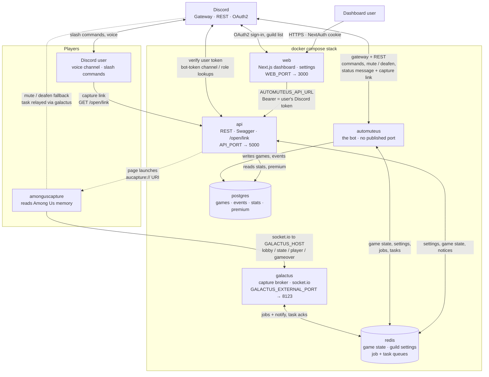
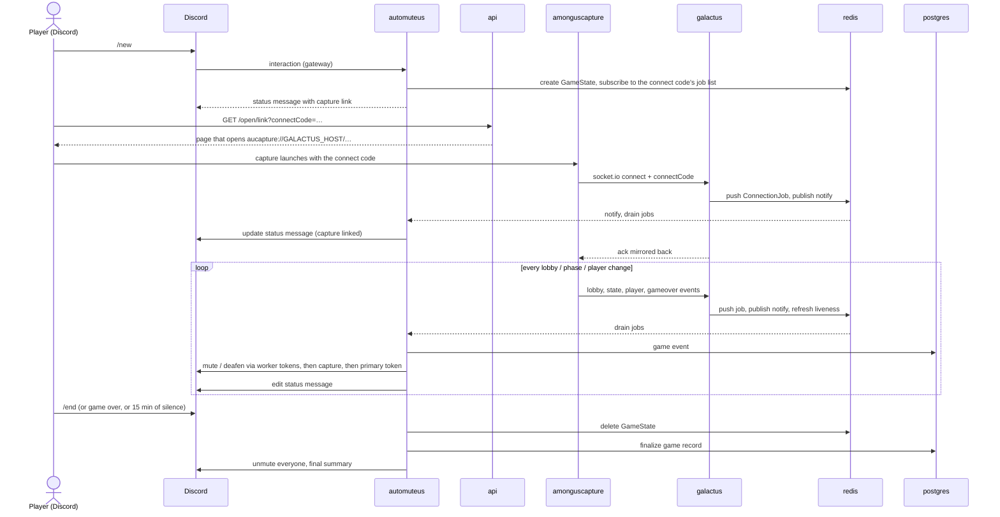

# Architecture

What the `docker compose` stack in this repository runs, and how the pieces talk to each other. All of the Go
services (bot, Galactus, API) come from [automuteus/automuteus](https://github.com/automuteus/automuteus) and share
one release tag; the dashboard, where guild settings are managed, comes from
[automuteus/web](https://github.com/automuteus/web) and is versioned on its own (see [The web UI](#the-web-ui)).

## Components and connections

Solid arrows are regular traffic. Dotted arrows are hand-offs that do not go over the compose network: the browser
launching the capture client through the `aucapture://` protocol, and the capture client applying mute/deafen
requests itself when the bot asks it to (the second step of the bot's rate-limit fallback chain, before the primary
token).

### Services

| Service | Image | Published port | Needs | Talks to |
| --- | --- | --- | --- | --- |
| `automuteus` | `automuteus/automuteus:${AUTOMUTEUS_TAG}` | none (health checks on container port 8080) | `DISCORD_BOT_TOKEN`, `HOST` (=`GALACTUS_HOST`), `WEB_URL` (for `/settings` links), Postgres credentials | Discord gateway + REST, Redis, Postgres. Optional `WORKER_BOT_TOKENS` open extra Discord sessions for mute/deafen. |
| `galactus` | `automuteus/galactus:${GALACTUS_TAG:-AUTOMUTEUS_TAG}` | `GALACTUS_EXTERNAL_PORT` → `BROKER_PORT` (8123) | `REDIS_ADDR`, `BROKER_PORT` | Capture clients (socket.io), Redis. Never talks to Discord or Postgres. |
| `api` | `automuteus/api:${API_TAG:-AUTOMUTEUS_TAG}` | `API_PORT` (8080) → `SERVICE_PORT` (5000) | `DISCORD_BOT_TOKEN`, `HOST`, Postgres credentials, optional `API_ADMIN_PASS` | Redis, Postgres, Discord REST. No gateway connection, so it runs and upgrades independently of the bot. |
| `web` | `automuteus/react-web:${WEB_TAG:-latest}` | `WEB_PORT` (3000) → 3000 | `NEXTAUTH_SECRET`, `DISCORD_CLIENT_ID`, `DISCORD_CLIENT_SECRET`, optional `WEB_URL` | The API over the compose network, Discord OAuth2 + REST. No database, Redis, or bot token. |
| `redis` | `redis:alpine` | none | | Persists guild settings, so its volume must survive `docker compose down`. |
| `postgres` | `postgres:18-alpine` | none | `POSTGRES_USER`, `POSTGRES_PASS` | Statistics and premium only; see "Upgrading Postgres" in the README. |

Three URLs must be reachable from *users'* machines, not just from the host: `GALACTUS_HOST` (where capture
connects), `API_SERVER_URL` (where the capture link in the `/new` message points), and `WEB_URL` (where `/settings`
sends people). Everything else is internal.

## Life of a game

## The web UI

The dashboard is a stateless Next.js app: it signs the user in with Discord OAuth2, keeps the resulting token in an
encrypted cookie, and proxies a fixed set of read/write routes to the Go API with that token as a bearer. The Go API
does the guild authorization on every call. In this stack:

- It is a regular part of the stack, since guild settings are managed there. `NEXTAUTH_SECRET`,
  `DISCORD_CLIENT_ID`, and `DISCORD_CLIENT_SECRET` are required, like the bot token: Compose refuses to start
  without them.
- `AUTOMUTEUS_API_URL` is fixed to `http://api:${SERVICE_PORT:-5000}`. Plain HTTP is accepted by the proxy, so the
  API reaches the dashboard over the compose network and `API_PORT` need not be public for the dashboard's sake.
- `WEB_URL` defaults to `http://localhost:${WEB_PORT:-3000}` and must be the dashboard's public URL. Compose hands
  the same value to the dashboard as `NEXTAUTH_URL` (for sign-in redirects) and to the bot (which links to
  `<WEB_URL>/settings?guild=<guild ID>` from `/settings`), so the two cannot drift.
  `<WEB_URL>/api/auth/callback/discord` must be registered as a redirect in the Discord developer portal. The bot's
  own application can be used; the dashboard also uses `DISCORD_CLIENT_ID` to build bot invite links.
- It needs outbound access to `discord.com`: the guild picker calls Discord directly, since the Go API has no
  guild-list route.
- Its health check hits `/api/live`. It has no database, no Redis, and no bot token.
